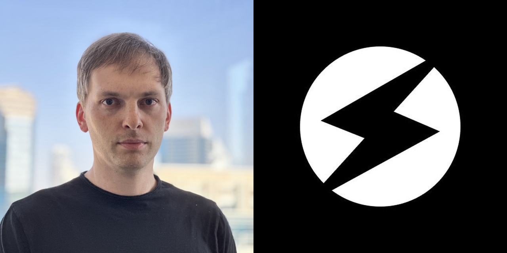

# The story of Tact language: from idea to release

Several major events happened recently in the TON Ecosystem regarding [Tact](https://tact-lang.org) language:

* Tact 1.0 was released, meaning the compiler got the basic feature set required for relying on Tact as a fully fleshed-out language. It should be noted that the compiler is still undergoing reviews and security audits.

* Tact Software Foundation was established. So while this community body is not a part of the TON Foundation, it is supported and guided by TON Foundation. Tact Software Foundation is managed by four founders that are very active in the TON community: **Oleg Andreev**, **Steve Korshakov**, **Tal Kol** and **Kirill Emelyanenko**. There are also two advisers: **Kirill Malev** and **Lyubov Shombina**.

* New ecosystem projects emerged such as the [Tact by Example](https://tact-by-example.org) website made by Tal Kol.

So Tact graduated to a new level of maturity, and it's time for many developers in the TON ecosystem to consider it.

But why was there a need for another language for TON if there are FunC and Fift? How did it all start? And how did it get to where it is today? To answer that, I reached out to some of the key people involved in Tact and they told me their perspectives.

## Oleg Andreev

_Oleg is best known in the TON community for his work on Tonkeeper, but he does more than that: among other things, he was the first person to lead the development of Tact._

When I was a newcomer to TON Ecosystem, I started using the FunC language, and sometimes it didn't look to me like a good match for the task at hand. I felt it was lacking some functionality and some abstractions. I've reached out to Kirill Emelyanenko from the TON core team. He told me a new language to help developers might be a good idea. And he even told me it should be named Tact.

The name "Tact" stands for "TON Actors," referring to the actor model used in TON. This async model is a little bit chaotic, it might introduce things like race conditions, so you have to design things really well while dealing with it. TON is a powerful technology, but a developer should have abstractions on top of TON to use all that power. So the idea of Tact (as well as some other things like TON API) was to unleash that power of TON and make it more useful for the people.

I started working on that with two other developers experienced in programming language design: Cxmog & Dmytro Polunin. In the first stage, we had some ideas but didn't have a complete vision of Tact. So it was an iterative R&D process. We were trying out different things, exploring how TVM works, the peculiarities of TON, and what should be hidden from the developers. We've created a website showcasing Tact abilities, and lots of people said that a tool like that is needed. 

It took us several months to realize some things about how smart contracts on TON should be written at all. At the beginning of TON, they were mostly written in a classic Ethereum-like way. But the uniqueness of TON is that it doesn't really let the developer work with arrays. All programming languages and computers are designed to efficiently iterate over some data — whether this data is in dictionaries, arrays, databases, or vectors. And TON says, "Hey, don't use arrays." You have loops, but they don't really scale. Creating a database creates a Denial-of-Service attack vector.

So how should we deal with it and create complex systems that require lists? For instance, if there is a DAO and it has a lot of members, how do we store it? I think that instead of creating lists in the contracts, we should make a contract for every member. And that's where it becomes hard to deal with FunC. So that's where Tact should ease it for the developer and make it convenient to create such complex systems.

We had that idea and we started exploring it. But we still didn't have a complete vision for Tact; we had other questions and unsolved problems. And at some point, the project was put on hold until we understood better what to do with them.

That's when Steve Korshakov comes into play. At the end of 2022, he quit TON Whales, so he had enough time on his hands and wanted to do something about Tact. We talked with him, I explained my vision for Tact, and he got to work.

He's rewritten the language almost from scratch, so the Tact we have today differs greatly from the one I worked on. But there's obvious progress. And even in some cases, when I disagreed with Steve at first, after thorough technical discussions, I've come to the conclusion that his vision is original and reasonable, and it solves the problem. And I'm still involved in Tact in a sort of "adviser" role: I don't do the hands-on work anymore, but I talk to Steve about the language development and may suggest something. So I'm pretty happy about how it all turned out.

## Steve Korshakov

_Steve became known in the TON community as a co-founder of TON Whales, and nowadays he develops Tact._

I joined the TON ecosystem first as a co-founder of TON Whales. And I often heard of Tact as "that language that will solve the issues we have today." Developing on TON at Whales, I've encountered a lot of issues myself. It was scary to update a contract holding millions. I had to set aside half a day to be sure I won't break anything and won't lock all that money. And I hoped Tact would make it all easier, but it kept not being released.

At the end of 2022, I sold my part in Whales and started to think about what to do next. Previously I had created some start-ups, but I always had a business co-founder, and at the moment, I was acting on my own. What could I do as a lone engineer? Code something useful. I've noticed that the Tact language development was not active at that time, and I thought it would be great to do that.

I've reached out to Oleg, and we discussed how I should proceed. I've learned Oleg's vision, and I've seen what was done by his team to that moment. But my vision is somewhat different and relies on the things I understood while working on TON in Whales.

Mostly my vision of Tact is that it's a pragmatic language. People who create new programming languages sometimes build "castles in the sky." They have some grand vision, lots of ideas, and their languages might turn out to be beautiful but rarely used for actual work. On the contrary, Tact is all about the real necessities of developers.

This approach is similar to the Kotlin language by JetBrains. That's a great language, but it's, first and foremost, a language for building real stuff in the real world; it's not just great for the sake of being great. There's no cultism like "we only do pure functional programming" or "we're only using tabs." I've worked at JetBrains previously — not on Kotlin itself, but I've dealt with its TS compiler. I like their approach with Kotlin, and I'm trying to do something similar for the TON ecosystem.

So lots of things in Tact are done in a very simple and straightforward way. Sometimes people look at the code of Tact compiler and tell me, "Oh, it looks much simpler than I was expecting it to be." But that's the point; I don't want it to be too complex. It's meant to write smart contracts, and they are relatively simple: there are a lot fewer lines of code than, say, in a messenger like Telegram. So a language for smart contracts can be much simpler than a language for things like messengers.

And that's also why Tact got released so quickly after I got to it, in a matter of months. It would be easy to work on that for years. But if you release early and iterate after that, it means the language can help people solve their problems today, not sometime in the future. 

Currently I'm mostly working alone on the language itself, but other people help with other ecosystem things. Like Tal Kol who has created [Tact by Example](https://tact-by-example.org), which is inspired to some degree by "Solidity by Example", but also adds on top of that. I'm very impressed by that website, I couldn't do it that good.

## Tal Kol

_Tal makes lots of things for the TON community: websites, tutorials, blog posts, and many more. It's no surprise he created a whole website that helps to learn Tact. The only question is, when does he sleep?_

When Oleg started working on Tact, I heard about it and his vision of the actor model. And I must say that I didn't quite get it at the beginning. 

I thought the issue with FunC could be resolved with a stronger standard library. FunC is a very low-level language: for example, when you parse messages, you need to know which bit is for bounce (or something else). And I thought we could create a library that abstracts away the internals and creates a higher-level API for FunC developers. And I wasn't sure that creating a new language was worth all this effort.

I didn't look much at Tact while Oleg and his team were working on it because they didn't have a public version ready for everybody to use. I started getting involved with Tact only after Steve started working on it. And I have to say, once I saw some of the things going on there I was convinced we need such a language. 

I think the best example of where Tact is important for me is the multi-sig contract. Multi-sig is very important because when you have a treasury, it's better if more than just one person holds it. Such a contract is implemented in FunC, but it's quite complicated. And when I was talking to the TON Foundation about moving grant payments to multi-sig, the fact that it was so complicated made us work very slowly.

When I looked at how Steve [implemented](https://github.com/tact-lang/tact/blob/main/examples/multisig.tact) the multi-sig contract in Tact, I saw it was beautiful. It's short, it's simple, and it does some very complicated things like a contract deploying another contract, so every multi-sig transaction is a sub-contract. And it's still very elegant. 

And this is what sold me on the concept. Because once you control the language, you control many more things than just a standard library. I think with a library, we could improve FunC by 50%. But we would never be able to simplify contract-contract or contract-user interaction to the level when a developer doesn't think about it at all: everything is done under the hood by language itself. So I became a believer in Tact.

Now I'm one of the founders of Tact Software Foundation, and I think there are three areas in particular where my contributions are important.

First, I'm coming from Web3, I've been working on Ethereum for the last five years, and decentralization is very important to me. Whenever somebody says, "This is not decentralized enough," it's usually me. And Tact gives me a lot of opportunities to do that, for example, with the ABI support. ABI was Steve's idea to add, and I think this is very, very important for decentralization. ABI allows people to access contracts without a client. This reduces dependency on the developers of clients, and even if clients get taken down, users will still have access to their money.

The second area is lowering the barrier for newcomers. We plan TON to be the mass adoption blockchain. For that, you also need mass adoption of developers. And right now, TON is very complicated. If you think about the people who designed TON, like the spiritual father Nikolai Durov — he is a very, very smart person, but it's probably difficult for him to see the world through the eyes of ordinary people. And what he created is amazing but somewhat unapproachable. Making TON approachable is a big undertaking. And that's something I invest a lot of my time in, and I’m very passionate about, with things like [tact-by-example.org](https://tact-by-example.org/).

And the third thing I bring to the table is resolving conflicts and making everybody work together. Lots of people working on TON have known each other for a long time. And their work together wasn't always smooth. If you look at history, there were plenty of arguments. And when conflicts escalate, it reduces the trust of the community: "If these people fight, what will happen to the tools that we need?" So I think it's very important to create something stable that people will hold on to for a long time. And this is something I invest a lot of energy in. And I think I add something that helps people to get along and understand that, ultimately, we all share the same goal — making TON successful.

The main thing that Tact is missing at the moment to be considered "production-ready" is a thorough security review. I don't think it's very dangerous, but there is a hypothetical possibility of vulnerabilities leading to backdoors in smart contracts. So we need it to be carefully reviewed and approved, and I think we'll get there, but it's gonna take a few months; it's not gonna be tomorrow. So my current suggestion for developers is to look realistically at how much money your contract would be managing. If it is more than 10 000 dollars (for example, you're creating a DEX), I would say write in FunC for now. But if you imagine that the value would be less than 10 000 dollars (for example, a hackathon project or a small game), you can do it with Tact already.

If you are writing a contract today that will hold more than 10,000 dollars and you really want to use Tact — you can, but you should audit the generated FunC code instead of the source Tact code. Tact compiler produces FunC code. This FunC is actually readable and auditable. Auditing the FunC will allow you to go around waiting for a full audit on the Tact compiler.

If you are a developer and would like to help Tact evolve, there are two ways. For the people who would like to "touch the core" and fiddle with the language itself: there are [issues](https://github.com/tact-lang/tact/issues) in the repository, and some are marked as "good first issues." We left these issues open just for you, so you can contribute to Tact something meaningful, which is not too difficult.

And for other people that don’t want to touch the core of Tact: the most helpful thing would be to record videos that show you building something and explaining what you do. You could make a simple project like a Tic-Tac-Toe game played between two players, where each sends one TON coin, and the winner gets them. In my eyes, teaching others how to implement and think in Tact is the most important thing for our ecosystem. I wrote a lot of content in tact-by-example.org — you are also welcome to help translate it.

## Kirill Emelyanenko

_Kirill is in the TON core team, and he was the one to suggest the idea of Tact to Oleg in the first place._

FunC is a very powerful language for experimenting: it is expressive enough to be used for complicated systems and lets you go down to the TVM level and do completely new things.

So it is absolutely indispensable at the birth of the ecosystem when it's not clear how contracts should work and which features and patterns to use. And it's still important today because many TVM features are not explored yet (no one touched the full power of Merkle proofs and storing code on the stack).

However, the ability to control all the small details has a downside: developers have to provide all these details and check for possible mistakes. And now that the patterns of programming smart contracts for TON have emerged, it feels like a good idea to hide the details "under the hood" in the common cases so the developers won't have to deal with them. 

That led to the idea of Tact. In early 2022 I wrote several examples of what the language might look like, we discussed it with Oleg, and he, having found good developers, undertook to implement it. I summarized the things that should be "hidden under the hood" this way:

**What do we need?**

We need a language familiar to developers used to other languages, such as JS, Python, and Solidity.

We need a language focused on best practices and safety rather than experimentation.

We need a language that provides safe, high-level abstractions over the complex underpinnings of the TON blockchain.

We need a language that does not require boilerplate code for common patterns.

**Why is FunC not sufficient?**

FunC has a number of limitations that we hope to solve in the new language:

1. Absence of native data structure types.
2. Inconvenient operations with the storage: when an update to the storage layout requires the developer to review and update the entire code of the contract.
3. There is no mechanism to ensure the safety of gas usage and gas bounds.
4. Inconvenient cross-contract interaction due to the absence of strongly typed interfaces and gas usage requirements.

***

In that list, the first two things are the most simple ones, the third one is harder, and the fourth one is the hardest but also the most important. 

Oleg's team decided that starting with the easiest things would be a bad idea because it would not be feasible to implement good interfaces and make cross-contract interaction convenient afterward. So to solve the main problem, they decided to create a powerful type system that goes through the whole language and lets you express anything (including the interfaces). 

Anatoliy Makosov and I endorsed this endeavor and secured funding. Unfortunately, after half a year of development, it was clear that a powerful type system had emerged, but the cross-contract interaction was not to be seen. And more than that, the language started to look academic in some ways — raising the entry barrier instead of lowering it. Alas, it became clear that it was a dead end. 

The development was halted. Later, in the fall of 2022, Steve got interested and decided to be practical: to do what could be done and leave the complexities to be dealt with at a later stage. That led to the current state of Tact: a language that has less boilerplate and is more familiar to developers who use popular languages.

But some problems are yet to be dealt with: gas safety and safe cross-contract interaction via interfaces are huge challenges. Some steps in that direction, such as ABI, were made, but there's a long way ahead. 

I see my current role in Tact as an adviser who helps with two things:

1. Technical expertise (we at TON Foundation have it more than anyone, even though we put a lot of effort into the documentation and explanations).

2. Focusing on what's the most important. It's easy to create a pretty and simple language by severely restricting its users. But for the ecosystem to be successful, we need to make a "Lego" out of smart contracts. So that any piece (a smart contract) would fit other ones. We need to implement scenarios where a Jetton can be traded for another Jetton to take some action in a game immediately, get an NFT as a result, vote with that NFT, update the state of the next contract, mint some new Jettons and put them into a lending protocol. Such a "Lego" creates a network effect not only on the user level (when the value of the network is proportional to n^2, n being the user number) but also a network effect on the contract level (when the value is proportional to n^2*m^2, m being the contract number). 

## Kirill Malev

_Kirill works at First Stage Labs, a company that invests in start-ups in the TON ecosystem. So here's a "venture capital point of view" from him._

I think in terms of capable and experienced teams choosing TON as a primary blockchain for building their projects. Suppose 100 teams try developing on TON for the first time. How many of them will decide to stay in the ecosystem? And how can we make that number higher?

I've discussed those questions with people like Anthony Tsivarev (he is currently in charge of development relations at TON Foundation). And it turned out that one of the important things was a more newcomer-friendly and modern-looking programming language. A language that lowers the entry barrier and makes the learning curve less steep can bring more developers who are used to Swift, Rust, or JavaScript. 

The point was not to lower the number of people using the FunC language. FunC is a nice robust language for building fast and efficient smart contracts and decentralized applications on the TON blockchain. The point was to give people with a background different from C or C++ a choice to start building on TON with something more familiar. FunC has advantages, but it works best for C developers who enjoy digging deep. And lots of developers are different. They are accustomed to languages such as JavaScript and Swift. They are not very interested in hardcore low-level optimizations. So there's a need for a language that would give them familiar syntax, hide some underlying things and let them create complex systems in a convenient way. 

From the moment I heard about such a language, I was in. When Oleg Andreev led the Tact development, I participated in internal discussions about it: for instance, what should we use as a "Definition of Done" when considering language maturity? We decided that it would be when there is a dApp written in that new language that will be used by 1000 daily active users per day for a week. That day hasn't come yet, but now with the 1.0 release, it's getting closer.

Also, we realized it was not enough to create the language alone, such as coding a compiler and putting it on GitHub. In order to create a language people would actually use, there's much more to be done: syntax highlighting in popular code editors, courses, articles, and docs... In order to be successful, Tact had to get all of those ecosystem elements. One such thing was the tact-lang.org website showcasing the new language. It was a success, and the community appreciated it. 

But later, the development came to a halt, and that was a bummer for me: I've counted on Tact to bring new developers to the ecosystem. So when there appeared a possibility of Steve continuing the job, I got involved again to facilitate it. I've compiled a doc with stakeholders' visions of Tact and helped to align the visions of Oleg, Steve, and all the stakeholders we could think of. Apart from the language itself, there was also the need to work on the organizational structure: who's in charge of what, and how does it all work? That led to the creation of Tact Software Foundation, where I have an adviser role.

Developing languages has its own challenges. If you want to create something like a mobile app, you can easily find many developers with experience. But there are much fewer people in the world who created their own programming languages, so knowledge in this field is much rarer. So if you're one of such people, we'd like to get in touch. Perhaps we both can tell each other interesting stuff. 

For me, being involved in the work on Tact was a blast — and still is a blast.

